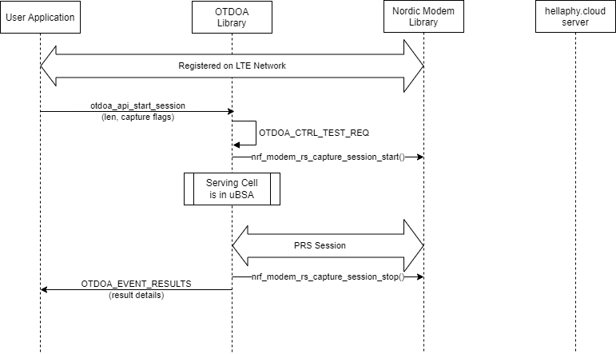
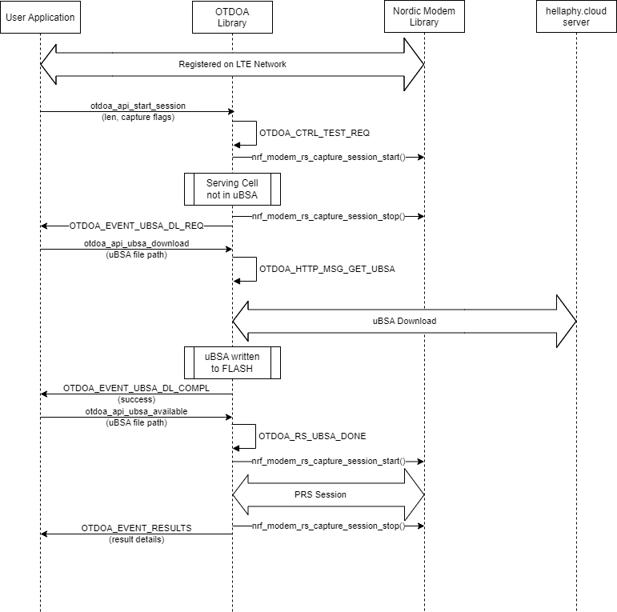
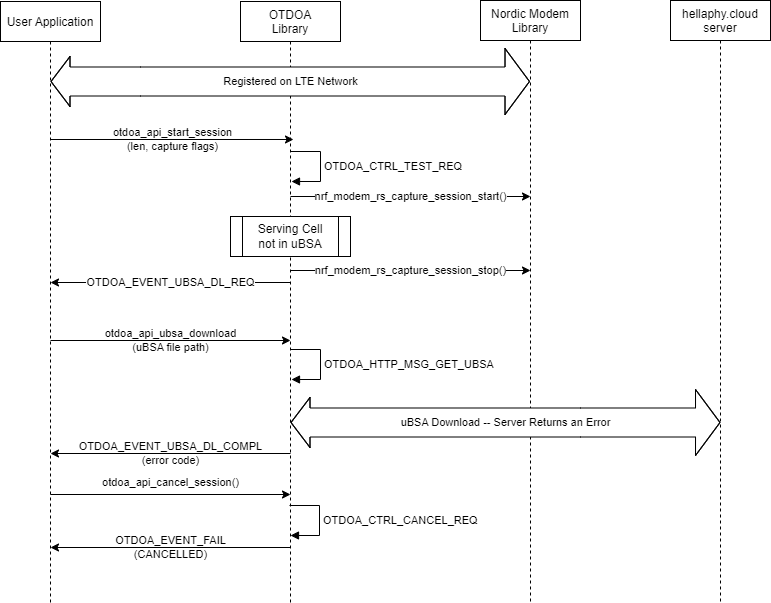
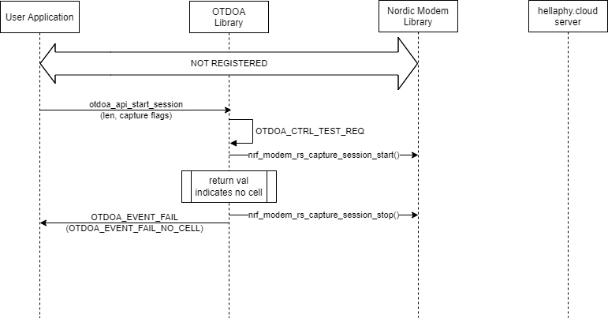
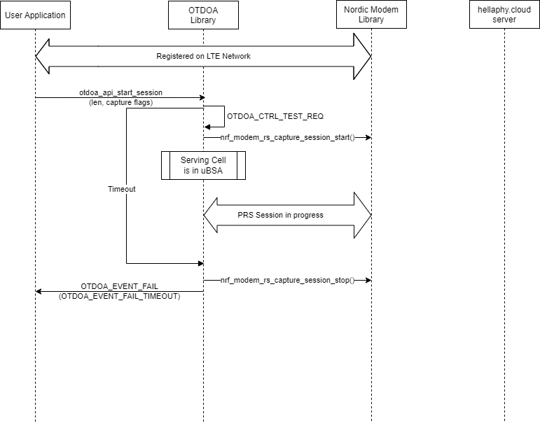

# Introduction
The OTDOA library API forms a clear and consistent interface between the user's application
and the PhyWi OTDOA library.  It may also be accessed by Nordic's Location Library if that
feature is enabled by the developer.

The sections below provide call sequences for a variety of normal case and failure scenarios.  There are two normal case scenarios, one where a new uBSA must be downloaded, and one where no uBSA download is required.

Each sequence shows API calls between the user application and the OTDOA Library.  This API is fully described in the file `lib/otdoa/include/phywi_otdoa_api`.

Note that the majority of the OTDOA library functions are implemented on a separate thread.
So API calls made by the location library / app are typically converted into a message that is sent to the OTDOA thread for processing.  These messages are shown in the sequence diagrams below (e.g. the `otdoa_api_start_session()` API call gets converted to an `OTDOA_CTRL_TEST` message sent to the OTDOA thread).

## PRS Session Normal Case without uBSA Download
In this case, the uBSA is already available in the file system, and it contains the current serving
cell.  So no uBSA download is required. 

The user application manages the connection to the LTE network.  In order to perform an
OTDOA position estimate, the UE must be connected to the live network.

The user application initiates the OTDOA position estimation by calling `otdoa_api_start_session()`.
The application can specify the duration of the position estimate in 160 ms. PRS occasions, as 
well as a timeout (in milliseconds) for the position estimate complettion.  The user application
also provides a callback function that will be used to return the position estimate results
to the application.

The OTDOA library directly accesses the nrfxlib RS Capture API to perform the position estimate.
It determines that the current serving cell is in the uBSA, and thus it can begin the position
estimate process (labelled "PRS Session" in the diagram)

Once the position estimate is complete, the results are returned to the user application 
(via a callback) in the OTDOA_EVENT_RESULTS event.

## PRS Session Normal Case with uBSA Download
In this sequence, a new uBSA must be downloaded before the position estimate can be done.  The OTDOA library detects that a new uBSA is required, and signals this to the user application in the OTDOA_EVENT_UBSA_DL_REQ event.

The user application then requests that the OTDOA library download a new uBSA using the `otdoa_api_ubsa_download()` API call.  This is done to allow the user application to "approve" the download.

When the download completes, the OTDOA library notifies the location library / app using the OTDOA_EVENT_UBSA_DL_COMPL event.  The location library / app then signals that the new uBSA is ready by calling the `otdoa_api_ubsa_available()` API.  The OTDOA library then executes the position estimate as described above, and returns the result to the user application in the OTDOA_EVENT_RESULTS event.

## uBSA Download Failure
If the uBSA download fails, the error is indicated to the user application in the
OTDOA_EVENT_UBSA_DL_COMPL event.  There are a number of possible causes for such a
failure, including:
- Loss of the LTE connection (e.g. out of service area)
- Failure to establish IP communication with the server
- Failure to authenticate with the server

In this case, the user application should then cancel the position estimate by calling the `otdoa_api_cancel_session()` API.  The OTDOA library will the return OTDOA_EVENT_FAIL event with a
cancelled error status.

## No Network Connection
In the case there is no connection to the network, the OTDOA library will return an OTDOA_EVENT_FAIL event to the user application.

## Session Canceled
The user application may cancel an OTDOA position estimate by calling the `otdoa_api_cancel_session()` API as shown in the figure below.

## Session Timeout
If the session times out, an OTDOA_EVENT_FAIL event is returned to the user application 
as shown in the figure below.

